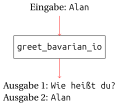

``` python, py-execute
def greet_bavarian(name: str) -> str:
    return 'Servus ' + name


def greet_bavarian_print(name: str) -> None:
    print('Servus ' + name)


def print_hello_and_goodbye() -> None:
    print('Hello')
    print('Goodbye')


def hello_and_goodbye_wrong() -> str:
    return 'Hello'
    print('Goodbye')
```

# Interaktive Programme

## Motivation

Der Zweck der Funktionen, die wir bisher geschrieben haben, war immer
die Berechnung und *Rückgabe* eines *Werts*. Wenn wir einen *Ausdruck*,
der einen Funktionsaufruf enthält, in die Shell eingeben, wird der
Funktionsaufruf ausgewertet, um den *Wert* des *Ausdrucks* zu berechnen.
Dieser wird dann in der nächsten Zeile angezeigt.

``` python, py-execute
def greet_bavarian(name: str) -> str:
    return 'Servus ' + name
```

``` python, py-execute
greet_bavarian('Ada')
greet_bavarian('Grace') + '!'
```


Wenn wir jedoch eine dieser Funktionen in einem Skript aufrufen, hat das
für den Benutzer keinen sichtbaren Effekt. Der Funktionsaufruf bzw. der
*Ausdruck* wird ausgewertet, und der Interpreter fährt mit der nächsten
Zeile fort.

<div class="minipage">

``` python, py-execute
greet_bavarian('Ada')
greet_bavarian('Grace') + '!'
```

</div>

<div class="minipage">

</div>

\
Die Benutzerinnen und Benutzer eines Programms wollen aber nicht
Funktionsaufrufe in die Shell eingeben. Sie wollen einfach ein Skript
oder Programm starten und danach etwas Nützliches angezeigt bekommen und
ggf. etwas eingeben. In diesem Kapitel wollen wir uns anschauen, wie das
funktioniert.

## Ausgabe

Um Werte bei der Ausführung eines Skripts anzuzeigen, können wir die
eingebaute Funktion `print` nutzen. Im Gegensatz zu allen Funktionen,
die wir bisher gesehen haben, hat diese keinen interessanten
Rückgabewert. Der Rückgabewert ist immer das Element `None`. Dies ist
das einzige Element mit dem Typ `NoneType`. Darin ist keinerlei
Information gespeichert. Die Funktion ist trotzdem sehr nützlich, weil
sie ihr Argument in der Konsole ausgibt.

<div class="minipage">

``` python, py-execute
print('Hello')
print(greet_bavarian('Ada'))
```

</div>

<div class="minipage">

Hello\
Servus Ada

</div>

\


## Unterschiede zwischen Rückgabe und Ausgabe

Es ist wichtig, sich den Unterschied zwischen der Rückgabe mit `return`
und der Ausgabe mit `print` klar zu machen. Ein zurückgegebener *Wert*
kann in einer Rechnung verwendet werden. Bei der Auswertung in einem
Skript wird er aber nicht automatisch angezeigt. Mit der Funktion
`print` können wir Werte in der Konsole ausgeben. Diese Funktion gibt
den Wert aber **nicht** zurück. Die Funktionen `greet_bavarian` und
`greet_bavarian_print` sehen deshalb sehr ähnlich aus. Sie sind aber
trotzdem sehr unterschiedlich.

<figure data-latex-placement="H">

</figure>

``` python, py-execute
greet_bavarian_print('Ada')
```

`Servus Ada` ist ein *Wert*, der von der Funktion `greet_bavarian_print`
ausgegeben wurde. Der Rückgabewert bei diesem Funktionsaufruf ist
`None`. Der Unterschied wird deutlich, wenn man den Funktionsaufruf in
einem Ausdruck verwendet.

``` python, py-execute
greet_bavarian_print('Ada') + '!'
```

`Servus Ada` ist die Ausgabe von `greet_bavarian_print('Ada')`. Erst
nach diesem Funktionsaufruf tritt der Fehler auf, da der *Rückgabewert*
`None` von `print_greet_bavarian_print` mit `'!'` addiert wird. Die
Fehlermeldung sagt aus, dass das nicht möglich ist, da ein *String*
nicht mit einem Element addiert werden kann, das den Typ `NoneType` hat.
Hätten wir an dieser Stelle die Funktion `greet_bavarian` genutzt, wäre
kein Fehler aufgetreten, da diese einen *String* zurückgibt.

``` python, py-execute
greet_bavarian('Ada') + '!'
```

Der Unterschied wird auch deutlich, wenn man das Ergebnis dieser
Funktionen in einer *Variablen* speichert.

``` python, py-execute
x = greet_bavarian('Ada')
x
```

Bei der Zuweisung in der ersten Zeile wird der *Wert* von
`greet_bavarian('Ada')` zwar berechnet und der *Variablen* zugewiesen.
Es ist aber nichts zu sehen. Der *Wert* der *Variablen* `x` ist
`'Servus Ada'` und wird deshalb nach der zweiten Zeile angezeigt.

Bei der Verwendung von `greet_bavarian_print` ist etwas völlig anderes
zu beobachten.

``` python, py-execute
x = greet_bavarian_print('Ada')
x
```

Bei der Auswertung der rechten Seite der ersten Zeile wird der *Wert*
zwar angezeigt. Da der *Rückgabewert* `None` ist, wird in der
*Variablen* auch nur dieser *Wert* gespeichert. Dieser wird nach der
letzten Zeile nicht angezeigt.

Der letzte wichtige Unterschied ist, dass bei der Ausführung eines
`return`-*Statements* die Funktion, die dieses enthält, verlassen wird.

``` python, py-execute
def hello_and_goodbye_wrong() -> str:
    return 'Hello'    
    print('Goodbye')
```

``` python, py-execute
hello_and_goodbye_wrong()
```

Bei Aufrufen von `print` ist dies nicht der Fall.

``` python, py-execute
def print_hello_and_goodbye() -> None:
    print('Hello')
    print('Goodbye')
```

``` python, py-execute
print_hello_and_goodbye()
```

## Eingabe

Mit der Funktion `input` können Benutzereingaben eingelesen werden. Als
*Argument* bekommt diese Funktion einen *String* übergeben. Bei der
Ausführung wird der *String* dem Benutzer angezeigt. Anschließend wird
auf seine Eingabe gewartet. Er muss dann etwas eingeben und dies mit
Enter bestätigen. Die Eingabe wird als *String* zurückgegeben.

``` python, py-execute
name = input('Wie heißt du? ')
name
```


Es ist oft sinnvoll diesen *Rückgabewert* in einer *Variablen* zu
speichern, um ihn später verwenden zu können.

``` python, py-execute
name = input('Wie heißt du? ')
name
```

## Kombination von Ein- und Ausgabe

Wir können nun interaktive Programme schrieben, in denen wir Eingabe,
Verarbeitung und Ausgabe kombinieren.

``` python, py-execute
def greet_bavarian_io() -> None:
    name = input('Wie heißt du? ')
    print(greet_bavarian(name)) 
```

Die Funktionen `print` und `input` sorgen dafür, dass auch, wenn die
Funktion in einem Skript aufgerufen wird, etwas zu sehen ist.\

<div class="minipage">

``` python, py-execute
greet_bavarian_io()
```

</div>

<div class="minipage">

Wie heißt du? <span style="color: blue">Alan</span>\
Servus Alan

</div>

\



Der Benutzer des Programms muss das Programm nur starten, um mit ihm zu
interagieren. Er muss selbst aber nichts über Programmierung wissen.
