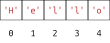

# Strings als Buchstaben-Container

## Motivation

*Strings* sind aus einzelnen Buchstaben zusammengesetzt. Wenn wir die
Buchstaben eines *Strings* von null beginnend durchnummerieren, steht
unter jedem Buchstaben eine Zahl, die *Index* genannt wird.



Mit einem *String* und dem *Index* eines Buchstabens in diesem *String*
können wir auf den Buchstaben zugreifen. Hierfür schreiben wir den
*Index* in eckigen Klammern hinter den *String*.

``` python, py-execute
'hello'[0]
'hello'[2]
```

Das funktioniert natürlich auch, wenn einer der *Ausdrücke* vor oder in
der Klammer zuerst ausgewertet werden muss.

``` python, py-execute
('good' + 'bye')[3 + 2]
x = 'hello'
x[3]
```

Die *Indizes* des *Strings* `'hello'` gehen nur von $`0`$ bis $`4`$.
Wenn wir einen *Index* größer als $`4`$ verwenden, erhalten wir einen
`IndexError`.

``` python, py-execute
'hello'[5]
```

## Länge eines Strings bestimmen

Die Länge eines *Strings* kann mit der Funktion `len` bestimmt werden.

``` python, py-execute
len('hello')
```

Da die *Indizes* eines *Strings* bei $`0`$ anfangen, ist der höchste
*Index* um eins kleiner als die Länge.

## Iteration über Indizes

Wir können mit einer `for`-*Schleife* über die *Indizes* eines *Strings*
iterieren. Hierbei schreiben wir in der Klammer die Länge des *Strings*.
Dadurch ist die *Zählervariable* bei der letzten Wiederholung um eins
kleiner als die Länge, was ja gerade dem höchsten *Index* entspricht.

``` python, py-execute
for i in range(len('hello')):
    print(i)

for i in range(len('bye')):
    print(i)
```

Im *Schleifenkörper* können wir die *Zählervariable* nutzen, um
nacheinander auf die Buchstaben im *String* zuzugreifen.

``` python, py-execute
greeting = 'hello'
for i in range(len(greeting)):
    print(greeting[i])
```

Wir können die *Zählervariable* auch direkt die Buchstaben in dem
*String* durchlaufen lassen.

``` python, py-execute
greeting = 'hello'
for char in greeting:
    print(char)
```

Die Buchstaben eines *Strings* sind selbst wieder *Strings*. D.h. wir
können mit ihnen die *String-Addition* durchführen.

``` python, py-execute
greeting = 'hello'
weird_greeting = ''
for char in greeting:
    weird_greeting = char + weird_greeting
weird_greeting
```
