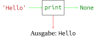
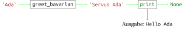

<!-- ``` python, py-execute
def greet_bavarian(name: str) -> str:
    return 'Servus ' + name


def greet_bavarian_print(name: str) -> None:
    print('Servus ' + name)


def print_hello_and_goodbye() -> None:
    print('Hello')
    print('Goodbye')


def hello_and_goodbye_wrong() -> str:
    return 'Hello'
    print('Goodbye')
``` -->

# Ausgabe mit print

## Motivation

Der Zweck der Funktionen, die wir bisher geschrieben haben, war immer
die Berechnung und *Rückgabe* eines *Werts*. Wenn wir einen *Ausdruck*,
der einen Funktionsaufruf enthält, in eine Zelle eingeben, wird der
Funktionsaufruf ausgewertet, um den *Wert* des *Ausdrucks* zu berechnen.
Dieser wird dann in der nächsten Zeile angezeigt.

``` python, py-execute
def greet_bavarian(name: str) -> str:
    return 'Servus ' + name
```

``` python, py-execute
greet_bavarian('Ada')
```


Normalerweise steht Programmcode aber nicht in Zellen, sondern in einer
Textdatei. Solche Textdateien mit Programmcode nennt man *Skript*.
Skripte erkennst du in diesem Buch am weißen Hintergrund.

Wenn wir eine dieser Funktionen in einem Skript aufrufen, hat das für
den Benutzer keinen sichtbaren Effekt. Der Funktionsaufruf bzw. der
*Ausdruck* wird ausgewertet, und der Interpreter fährt mit der nächsten
Zeile fort.

<script type="py-editor">
def greet_bavarian(name: str) -> str:
    return 'Servus ' + name

greet_bavarian('Ada')
</script>


Die Benutzerinnen und Benutzer eines Programms wollen aber nicht
Funktionsaufrufe in eine Zelle eingeben. Sie wollen einfach ein Skript
oder Programm starten und danach etwas Nützliches angezeigt bekommen und
ggf. etwas eingeben. In diesem Kapitel wollen wir uns anschauen, wie das
funktioniert.

## Ausgabe

Um Werte bei der Ausführung eines Skripts anzuzeigen, können wir die
Funktion `print` nutzen. 


<script type="py-editor">
print('Hello')
</script>

Wir können `print` auch verwenden, um den Rückgabewert von
`greet_bavarian('Ada')` anzuzeigen.

<script type="py-editor">
def greet_bavarian(name: str) -> str:
    return 'Servus ' + name

print(greet_bavarian('Ada'))
</script>

Die gleiche Ausgabe kann auch erreicht werden, wenn wir in der
Definition von `greet_bavarian` statt `return` `print` verwenden.

<script type="py-editor">
def greet_bavarian_print(name: str) -> str:
    print('Servus ' + name)

greet_bavarian_print('Ada')
</script>

Die Ausgabe erfolgt dann durch die Funktion selbst und nicht erst danach,
wie im letzten Beispiel.

## Fehlender Rückgabewert


Im Gegensatz zu allen Funktionen, die wir bisher gesehen haben, hat
Diese keinen interessanten Rückgabewert. Der Rückgabewert ist immer das
Element `None`. Dies ist das einzige Element mit dem Typ `NoneType`.
Darin ist keinerlei Information gespeichert. Die Funktion ist trotzdem
sehr nützlich, weil sie ihr Argument in der Konsole ausgibt.






## Unterschiede zwischen Rückgabe und Ausgabe

Es ist wichtig, sich den Unterschied zwischen der Rückgabe mit `return`
und der Ausgabe mit `print` klar zu machen. Ein zurückgegebener *Wert*
kann in einer Rechnung verwendet werden. 

``` python, py-execute
def greet_bavarian(name: str) -> str:
    return 'Servus ' + name
```

``` python, py-execute
greet_bavarian('Ada')
```


Bei der Auswertung in einem Skript wird er aber nicht automatisch angezeigt. Mit der Funktion
`print` können wir Werte auch dann anzeigen, wenn ein Skript ausgeführt wird. Diese Funktion gibt
den Wert aber **nicht** zurück. Die Funktionen `greet_bavarian` und
`greet_bavarian_print` sehen deshalb sehr ähnlich aus. Sie sind aber
trotzdem sehr unterschiedlich.


``` python, py-execute
def greet_bavarian_print(name: str) -> str:
    return 'Servus ' + name
```

``` python, py-execute
greet_bavarian_print('Ada')
```

`Servus Ada` ist ein *Wert*, der von der Funktion `greet_bavarian_print`
ausgegeben wurde. Der Rückgabewert bei diesem Funktionsaufruf ist
`None`. Der Unterschied wird deutlich, wenn man den Funktionsaufruf in
einem Ausdruck verwendet.

``` python, py-execute
greet_bavarian_print('Ada') + '!'
```

`Servus Ada` ist die Ausgabe von `greet_bavarian_print('Ada')`. Erst
nach diesem Funktionsaufruf tritt der Fehler auf, da der *Rückgabewert*
`None` von `greet_bavarian_print` mit `'!'` addiert wird. Die
Fehlermeldung sagt aus, dass das nicht möglich ist, da ein *String*
nicht mit einem Element addiert werden kann, das den Typ `NoneType` hat.


Der Unterschied wird auch deutlich, wenn man das Ergebnis dieser
Funktionen in einer *Variablen* speichert.

``` python, py-execute
x = greet_bavarian('Ada')
x
```

Bei der Zuweisung in der ersten Zeile wird der *Wert* von
`greet_bavarian('Ada')` zwar berechnet und der *Variablen* zugewiesen.
Es ist aber nichts zu sehen. Der *Wert* der *Variablen* `x` ist
`'Servus Ada'` und wird deshalb nach der zweiten Zeile angezeigt.

Bei der Verwendung von `greet_bavarian_print` ist etwas völlig anderes
zu beobachten.

``` python, py-execute
x = greet_bavarian_print('Ada')
x
```

Bei der Auswertung der rechten Seite der ersten Zeile wird der *Wert*
zwar angezeigt. Da der *Rückgabewert* `None` ist, wird in der
*Variablen* auch nur dieser *Wert* gespeichert. Dieser wird nach der
letzten Zeile nicht angezeigt.

Der letzte wichtige Unterschied ist, dass bei der Ausführung eines
`return`-*Statements* die Funktion, die dieses enthält, verlassen wird.

``` python, py-execute
def hello_and_goodbye_wrong() -> str:
    return 'Hello'    
    print('Goodbye')
```

``` python, py-execute
hello_and_goodbye_wrong()
```

Bei Aufrufen von `print` ist dies nicht der Fall.

``` python, py-execute
def print_hello_and_goodbye() -> None:
    print('Hello')
    print('Goodbye')
```

``` python, py-execute
print_hello_and_goodbye()
```

