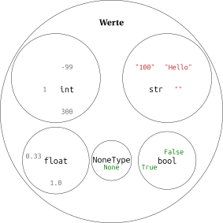

# Datentypen

## Einteilung von Werten in Datentpyen

Wir haben mit *Integern* und *Strings* zwei verschiedene Arten von
*Werten* kennengelernt und gesehen, dass mit verschiedenen Arten von
*Werten* unterschiedliche *Operationen* durchgeführt werden können. Eine
solche Menge von *Werten*, die bestimmte *Operationen* unterstützt,
nennt man *(Daten-)Typ*. Die *Typen*, die wir in diesem Schuljahr
kennenlernen werden, sind in der folgenden Abbildung dargestellt.



`str` steht für *String*, und `int` für *Integer*. Diese Abkürzungen
haben wir schon genutzt, um zu kennzeichnen, zu welchem Datentyp die *Argumente* und
der Rückgabewert einer Funktion gehören. Die weiteren *Typen*
werden wir in den folgenden Kapiteln kennenlernen.

## Typfehler

*Operationen* sind immer nur für bestimmte Kombinationen von *Typen*
definiert. Wir haben schon gesehen, dass man einen *String* und ein
*Integer* miteinander multiplizieren kann.

``` python, py-execute
3 * 'good bye'
```

Wir können aber **nicht** einen *String* und ein *Integer* addieren.

``` python, py-execute
1 + '2'
```

Die Fehlermeldung sagt aus, dass der *Operator* `+` nicht definiert ist,
wenn der linke *Operand* ein *Integer* und der rechte *Operand* ein
*String* ist.

Auch die Multiplikation ist nicht für beliebige Kombinationen von
*Typen* definiert.

``` python, py-execute
'3' * 'x'
```

Die Fehlermeldung sagt aus, dass wir eine Zeichenfolge (`sequence`) nur
mit einem *Integer* und nicht mit einem weiteren *String* multiplizieren
können.

<!-- ## Typannotation

Beim Implementieren einer Funktion haben wir bisher immer angegeben,
dass man bei einem Funktionsaufruf ein *Integer* als *Argument*
übergeben muss und dass sie ein *Integer* zurückgibt.

``` python, py-execute
def square(x: int) -> int:
    return x * x
```

Tatsächlich führt ein Aufruf mit einem *String* bei diesem Beispiel zu
einem *Typfehler*, weil im *Funktionskörper* ein *String* mit einem
*String* multipliziert wird. Wir haben oben gesehen, dass das nicht
funktioniert.

``` python, py-execute
square('3')
```

Um solche Fehler zu vermeiden, sollte man immer die *Typen* der
*Parameter* und den *Typ* des *Rückgabewerts* angeben. Anhand dieser
kann man schon beim Lesen des *Funktionskopfes* erkennen, mit welchen
*Argumenten* die Funktion ohne Probleme aufgerufen werden kann.

Diese Angabe der *Typen* der Parameter und des *Rückgabewerts* erfolgt
immer mit den Zeichen `:` und `->`. Neben `int` für *Integer* müssen wir
aber noch weitere Abkürzungen für *Typen* kennen. -->

## Typkonversion

Es kommt häufig vor, dass ein *Wert* einen *Typ* hat, mit dem eine
gewünschte *Operation* nicht durchgeführt werden kann.

``` python, py-execute
number = 3
```
``` python, py-execute
message = 'The value of number is: '
```

``` python, py-execute
message + number
```

Um den *Typ* eines *Werts* zu ändern, können die Funktionen `int`
und `str` genutzt werden. Diese geben einen *Wert* mit dem
entsprechenden *Typ* zurück.

``` python, py-execute
str(number)
```
``` python, py-execute
message + str(number)
```
``` python, py-execute
int('052')
```

Fast jeder *Wert* kann in einen *String* umgewandelt werden. Aber
natürlich kann nicht jeder *String* zu einem *Integer* konvertiert
werden.

``` python, py-execute
int('hello')
```
