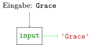

# Eingabe


## Motivation

Die Funktionen, die wir bisher geschrieben haben, haben wir im Code die
notwendigen Argumente übergeben. Im folgenden Beispiel wird der String
`'Wie heißt du? '` an die Funktion `greet_bavarian_print` übergeben.

<script type="py-editor">
def greet_bavarian_print(name: str) -> str:
    print('Servus ' + name)

greet_bavarian_print('Ada')
</script>

Wenn eine andere Person begrüßt werden soll, muss `Ada` durch einen
anderen Namen ersetzt werden. Dafür muss man schon einiges über
Programmierung wissen.

Schöner und nutzerfreundlicher wäre es natürlich, wenn der Benutzer nach
seinem Namen gefragt wird. In diesem Kapitel lernst du, wie das
funktioniert.

## Einlesen von Eingaben mit `input`

Mit der Funktion `input` können Benutzereingaben eingelesen werden. Die
Funktion hat keine Parameter. Bei der Ausführung wird auf die Eingabe des
Benutzers gewartet. Er muss dann etwas eingeben und dies mit Enter
bestätigen. Die Eingabe wird als *String* zurückgegeben.

``` python, py-execute
input()
```

**Beispiel**: Eingabe von *Grace*


Es ist oft sinnvoll, diesen *Rückgabewert* in einer *Variablen* zu
speichern, um ihn später verwenden zu können.

``` python, py-execute
name = input('Wie heißt du? ')
```
``` python, py-execute
name
```

## Kombination von Ein- und Ausgabe

Wir können nun interaktive Programme schreiben, in denen wir Eingabe,
Verarbeitung und Ausgabe kombinieren.

``` python, py-execute
def greet_bavarian_io() -> None:
    print('Wie heißt du? ')
    name = input()
    print('Servus ' + name)
```

``` python, py-execute
greet_bavarian_io()
```


Die Funktionen `print` und `input` sorgen dafür, dass auch, wenn die
Funktion in einem Skript aufgerufen wird, etwas zu sehen ist.


Das Programm kannst du in folgendem Block testen:
<script type="py" terminal worker>
name = await input("Wie heißt du? ")
print("Servus " + name)
</script>

Der Benutzer des Programms muss das Programm nur starten, um mit ihm zu
interagieren. Er muss selbst aber nichts über Programmierung wissen.

## Aufgaben

[Zu den Aufgaben zu diesem Kapitel](./eingabe_aufgaben.md)
