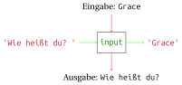

# Eingabe

Mit der Funktion `input` können Benutzereingaben eingelesen werden. Als
*Argument* bekommt diese Funktion einen *String* übergeben. Bei der
Ausführung wird der *String* dem Benutzer angezeigt. Anschließend wird
auf seine Eingabe gewartet. Er muss dann etwas eingeben und dies mit
Enter bestätigen. Die Eingabe wird als *String* zurückgegeben.

``` python, py-execute
name = input('Wie heißt du? ')
name
```



Es ist oft sinnvoll diesen *Rückgabewert* in einer *Variablen* zu
speichern, um ihn später verwenden zu können.

``` python, py-execute
name = input('Wie heißt du? ')
name
```

## Kombination von Ein- und Ausgabe

Wir können nun interaktive Programme schreiben, in denen wir Eingabe,
Verarbeitung und Ausgabe kombinieren.

``` python, py-execute
def greet_bavarian_io() -> None:
    name = input('Wie heißt du? ')
    print(greet_bavarian(name))
```

Die Funktionen `print` und `input` sorgen dafür, dass auch, wenn die
Funktion in einem Skript aufgerufen wird, etwas zu sehen ist.\

<div class="minipage">

``` python, py-execute
greet_bavarian_io()
```

</div>

<div class="minipage">

Wie heißt du? <span style="color: blue">Alan</span>\
Servus Alan

</div>

\


Der Benutzer des Programms muss das Programm nur starten, um mit ihm zu
interagieren. Er muss selbst aber nichts über Programmierung wissen.
