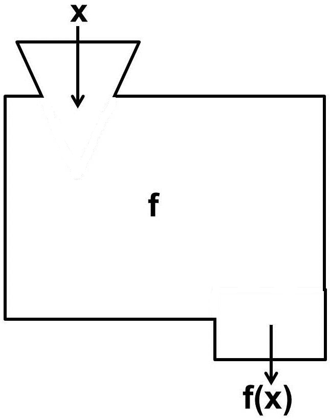
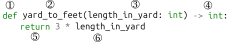

# Funktionen

## Motivation

Die folgende Matheaufgabe können wir einfach in der Shell lösen.


**Mathematikaufgabe 1**. *Für die englischen Längeneinheiten Fuß und
Yard gilt:*

- *Ein Yard sind \\(3\\) Fuß.*

- *a)* Wie viel sind \\(7\\) Yard in Fuß
- *b)* wie viel sind \\(19\\) Yard in
Fuß?*


**Lösung 1**.

``` python, py-execute
3 * 7
```
``` python, py-execute
3 * 19
```


Die Lösung funktioniert zwar. Es gibt jedoch ein paar Probleme mit dem
Code.

- Wenn wir den Code später ohne die Aufgabe lesen, wissen wir
  höchstwahrscheinlich nicht, was wir berechnen wollten.

- Die Multiplikation mit \\(3\\), um eine Länge in Yard in eine Länge in
  Fuß umzurechnen, taucht zweimal auf.

- Wenn wir nach der Rechnung feststellen würden, dass ein Yard
  tatsächlich \\(4\\) Fuß sind, müssten wir den Code an beiden Stellen
  ändern.

Beide Probleme kann man mit Hilfe von Funktionen vermeiden.

## Grundlegendes zu Funktionen

Eine Funktion kann man sich als eine Maschine vorstellen, die je nach
*Input* (*Argument*) einen entsprechenden *Output* (*Funktionswert*)
produziert. Wenn der Name der Funktion *g* ist, bezeichnet man für
einen *Input* *x* den dazugehörigen *Output* als *g(x)*. Die
Funktionsgleichung gibt an, wie sich der *Output* aus dem *Input*
berechnen lässt.

<div align="center">
  
  <p style="font-size: 0.8em; color: gray; margin-top: 5px;">
    Quelle: <a href="https://madipedia.de/wiki/Funktionsmaschine">Madipedia</a>, Lizenz: <a href="https://creativecommons.org/licenses/by-nc-sa/3.0/deed.de">CC BY-NC-SA 3.0</a>
  </p>
</div>

<!--  -->

Die Funktionsmaschine der Funktion *g* mit der Funktionsgleichung
$$g(x) = 3 \cdot x$$
nimmt eine beliebige Zahl als *Input* und gibt das Produkt dieser Zahl
mit *3* zurück. Wenn z.B. der *Input* die Zahl *4* ist, kann man den
*Output* berechnen, indem man *4* in den Funktionsterm an der Stelle
von *x* einsetzt. Das Ergebnis ist dann
$$g(4) = 3 \cdot 4 = 12$$


<!--  -->

## Funktionen definieren und aufrufen

Die Funktion *g* steht für die Umrechnung von Yard in Fuß. Wir wollen
diese also in Python mit einem besser lesbaren Namen implementieren.
Dies ist folgendermaßen möglich:

``` python, py-execute
def yard_to_feet(lengt_in_yard: int):
    return 3 * lengt_in_yard
```





Anschließend kann sie folgendermaßen im Code aufgerufen werden:

``` python, py-execute
yard_to_feet(7)
```

1.  Eine Funktionsdefinition beginnt immer mit dem Schlüsselwort `def`.

2.  Dahinter steht der Name[^1] der Funktion (hier: `yard_to_feet`).

3.  Das `length_in_yard` in der runden Klammer ist ein Platzhalter
    (*Parameter*) für einen konkreten Wert (Argument), der beim Aufruf
    übergeben werden muss. Mit `: int` wird angegeben, das beim
    Funktionsaufruf für diesen *Parameter* ein *Integer* übergeben
    werden muss. Z.B. werden in den Funktionsaufrufen oben die *Integer*
    `7` und `19` übergeben.

4.  Mit `-> int` wird angegeben, dass der Rückgabewert der Funktion
    immer ein *Integer* ist. Die erste Zeile wird *Funktionskopf*
    genannt und muss mit einem *Doppelpunkt*(`:`) abgeschlossen werden.

5.  In der zweiten Zeile wird festgelegt, was die Funktion zurückgeben
    soll. Hierfür schreibt man das Schlüsselwort `return` mit vier
    Leerzeichen eingerückt.

6.  Dahinter folgt ein *Ausdruck*. Dieser kann den *Parameter* der
    Funktion enthalten. Beim Funktionsaufruf wird dieser Parameter durch
    den übergebenen *Wert* des *Arguments* ersetzt. Beim Aufruf von
    `yard_to_feet(7)` wird also in dem *Ausdruck* `3 * length_in_yard`
    der *Parameter* `length_in_yard` durch den *Wert* `7` ersetzt. Der
    *Ausdruck* `3 * 7` wird dann zu `21` ausgewertet und zurückgegeben.
    Anders ausgedrückt: Der *Ausdruck* `yard_to_feet(7)` wird zu `21`
    ausgewertet.

Schlüsselwörter wie `def` und `return` zeigen dem Python-Interpreter,
was zu tun ist. Sie dürfen deshalb **nicht** als Name von Funktionen und
Variablen verwendet werden.


Beim Aufruf schreibt man nur den Namen der Funktion und in Klammern den Wert, den man der Funktion übergibt.

``` python, py-execute
yard_to_feet(7)
```


[^1]: Für die Namen von Funktionen gelten die selben Regeln wie für die
    Namen von Variablen
