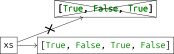
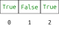

# Listen

## Motivation

Wir haben gesehen, dass ein *String* aus einzelnen Buchstaben besteht,
auf die wir zugreifen können. Man sagt auch, dass ein *String* ein
*Container* ist. Es ist auch für andere *Datentypen* möglich, mehrere
Werte in einem Container zu speichern. Dafür verwenden wir sogenannte
*Listen*.

## Listen sind Werte

In einer *Liste* können mehrere *Werte* mit demselben *Typ* gespeichert
werden. Eine *Liste* wird erzeugt, indem wir zwischen eckigen Klammern
die Elemente der *Liste* durch Kommas getrennt auflisten.

``` python, py-execute
[True, False, True]
```

*Listen* beinhalten *Werte* und sind selbst wieder *Werte*. Wir können
also *Literale* für *Listen* in *Ausdrücken* verwenden. Eine
*Operation*, die auf *Listen* definiert ist, ist die Addition. Durch sie
werden zwei *Listen* zusammengefügt.

``` python, py-execute
[True] + [False]
```

Wir können *Listen* in *Variablen* speichern.

``` python, py-execute
xs = [True, False]
xs
```

Außerdem können wir Funktionen schreiben, die *Listen* als *Argumente*
entgegen nehmen, und/oder eine *Liste* zurückgeben.

``` python, py-execute
def repeat_three_times(xs: list[bool]) -> list[bool]:
    return xs + xs + xs
```

``` python, py-execute
repeat_three_times([True, False])
```

Bei der *Typannotation* schreibt man `list` und in eckigen Klammern den
*Typ* der Elemente in der *Liste*.

## Iteration über Listen

Listen können mit `for`-Schleifen durchlaufen werden.

``` python, py-execute
xs = [True, False]
for x in xs:
    print(x)
```

## Elemente hinzufügen

Wenn wir einer *Liste* ein Element hinzufügen wollen, können wir
stattdessen auch die *Liste* durch eine neue *Liste*, die aus der alten
*Liste* und dem neuen Element besteht, ersetzen.

``` python, py-execute
xs = [True, False, True]
```


``` python, py-execute
xs = xs + [False]
xs
```



## Listen als Container

In den nächsten Abschnitten werden wir *Listen* als Container benutzen,
so wie wir das schon mit *Strings* getan haben.

Auch die Elemente einer *Liste* haben *Indizes*, die mit \\(`0`\\) beginnen.
Die können wir nutzen, um auf diese Elemente zuzugreifen.


``` python, py-execute
x = ['hello', 'how', 'are', 'you']
x[2]
```

Das funktioniert natürlich auch, wenn einer der *Ausdrücke* vor oder in
der Klammer zuerst ausgewertet werden muss.

``` python, py-execute
x = ['hello', 'how', 'are', 'you']
x[3]
```

Die *Indizes* der *Liste* `[True, False, True]` gehen nur von \\(`0`\\) bis
\\(`2`\\). Wenn wir einen *Index* über \\(`2`\\) verwenden, erhalten wir einen
`IndexError`.

``` python, py-execute
[True, False, True][3]
```

## Länge einer Liste bestimmen

Die Länge einer *Liste* kann mit der Funktion `len` bestimmt werden.

``` python, py-execute
len([True, False, True])
```

Da die *Indizes* einer *Liste* bei \\(`0`\\) anfangen, ist der höchste
*Index* um eins kleiner als die Länge.

## Iteration über Indizes

Wir können mit einer `for`-*Schleife* über die *Indizes* einer *Liste*
iterieren. Im *Schleifenkörper* können wir die *Zählervariable* nutzen,
um nacheinander auf die Elemente in der *Liste* zuzugreifen.

``` python, py-execute
xs = [True, False, True, False]
for i in range(0, len(xs)):
    print(xs[i])
```

Wenn man den Start und Endwert der Zahlervariablen anpasst, kann man
auch nur über einen Teil der Liste iterieren.

``` python, py-execute
xs = [True, False, True, False]
for i in range(1, len(xs) - 1):
    print(xs[i])
```
