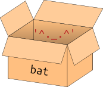

# Strings

## Strings sind Werte

Alle *Werte*, die wir bisher genutzt haben, waren ganze Zahlen
(*Integer*). Es gibt aber noch völlig andere *Werte*, zum Beispiel
Zeichenketten (*Strings*) wie `'Hello'`, `'^._.^'` und `'12345'`.
*Strings* beginnen und enden mit einem Hochkomma (`'`).

Da *Strings* *Werte* sind, können wir diese in *Ausdrücken* verwenden.
Eine *Operation*, die mit zwei *Strings* durchgeführt werden kann, ist
die *String*-Addition. Dabei wird dasselbe `+` wie bei der Addition von
Zahlen verwendet. Die *Strings* werden mit dieser *Operation* aber
aneinandergehängt.

``` python, py-execute
'hallo' + 'tschüss'
'123' + '456' + '789'
```

Hierbei ist es egal, dass die *Strings* im letzten Beispiel Zahlen
darstellen. Durch die Hochkommas handelt es sich zum Beispiel bei
`'123'` um ein *String* und **nicht** um einen *Integer*. Wir
können damit also keine *Integer*-Addition durchführen.

Eine *Operation*, die mit einem *String* und einem *Integer* ausgeführt
werden kann, ist die Multiplikation. Der *String* wird dabei wiederholt.

``` python, py-execute
3 * 'hello '
```

## Strings und Variablennamen

*Strings* kann man wie alle anderen *Werte* in *Variablen* speichern.

``` python, py-execute
bat = '^._.^'
```



Auf der rechten Seite des Zuweisungsoperators werden Hochkommas
verwendet, aber nicht auf der linken Seite. Das liegt daran, dass `bat`
der Name der *Variable* ist und **kein** String. Der *Wert*, der in
dieser *Variable* gespeichert ist, ist der *String* `'^._.^'`. Wenn wir
die *Variable* in einem *Ausdruck* verwenden, wird sie durch ihren
*Wert* ersetzt.

``` python, py-execute
'A bat looks like this: ' + bat
```

Hier steht `'A bat looks like this: '` zwischen Hochkommas, weil es sich
dabei um einen *String* und nicht um einen *Variablennamen* handelt. Wir
wollen ja, dass genau dieser Text im Ergebnis steht und meinen damit
nicht den Inhalt oder Wert einer *Variablen*.

## Fehler beim Verwechseln von Strings und Variablennamen

Wenn wir den *Variablennamen* `bat` zwischen Hochkommas schreiben,
handelt es sich nicht mehr um den Namen einer *Variablen*, sondern um
einen *String* (also einen *Wert*). Dieser *Wert* hat **nichts** mit der
*Variablen* zu tun und taucht deshalb unverändert im Ergebnis auf.

``` python, py-execute
'A bat looks like this: ' + 'bat'
```

Wenn wir die Hochkommas um einen String wie `'looks '` weglassen,
erhalten wir eine Fehlermeldung.

``` python, py-execute
looks
```

Python denkt, dass wir eine *Variable* mit dem Namen `looks` verwenden
wollen. Eine *Variable* mit diesem Namen ist aber nicht definiert.
